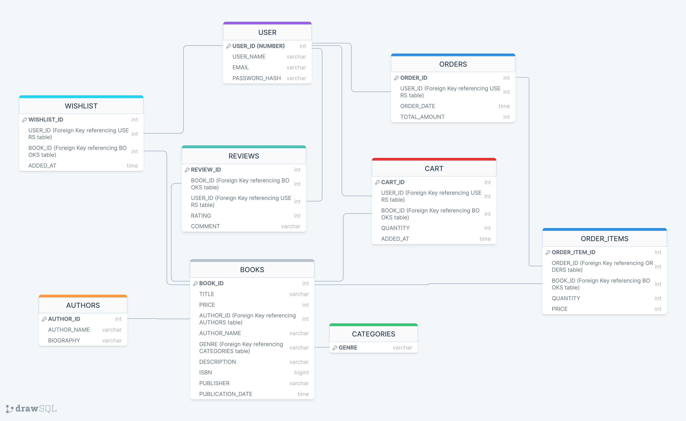
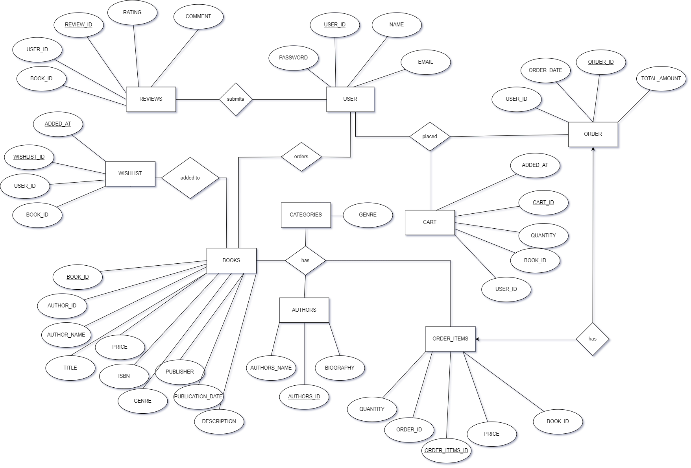

# Book_World
# Abstract
The "Online Book Store" project is a comprehensive web-based application developed using Oracle APEX. This system facilitates a seamless online platform for users to browse, search, and purchase books. The key features of the application is user friendly interface, search books by book name, authors name, title, or genre, and a personalized wishlist for users to bookmark their favorite books. The system also integrates  a purchasing cart allowing users to manage their purchases efficiently. Additionally, the platform supports users to add books into the booklist which can be approved by the administrator. The project aims to provide a convenient and efficient solution for book enthusiasts to access a wide variety of books, while also offering a scalable and maintainable framework for administrators to manage inventory,analyze highest order data and also analyze sales. By leveraging the capabilities of Oracle APEX, the "Online Book Store" ensures good performance, reliability, and user satisfaction.
# Schema Diagram

# Entity Relationship Diagram
